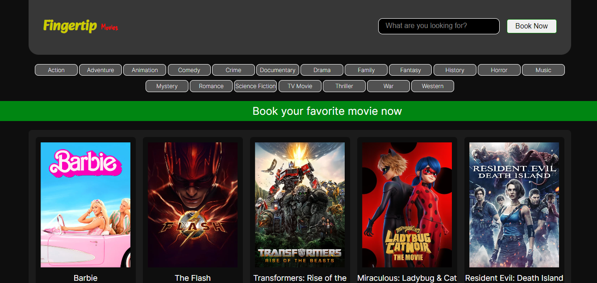
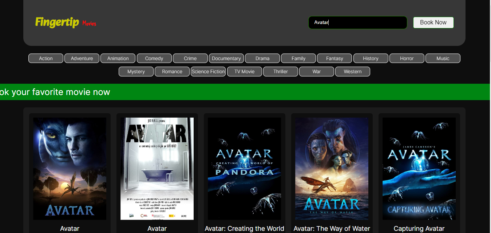
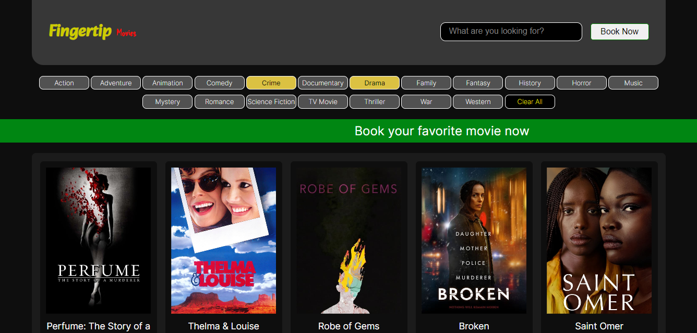
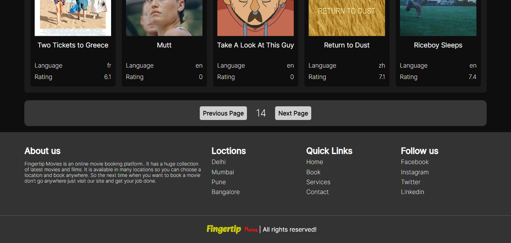
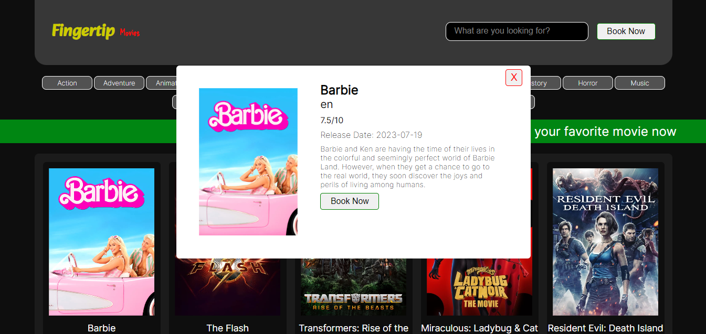
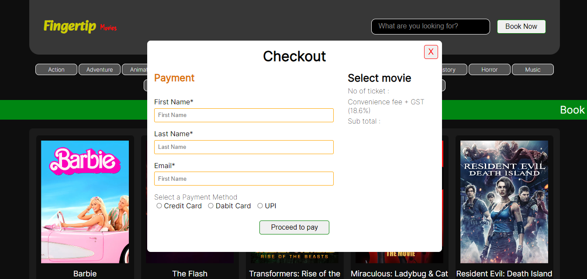

# Fingertip Movies

Fingertip Movies is a dynamic and user-friendly web application that allows users to discover and search for movies. It's built using HTML, CSS, and JavaScript, making it lightweight and easy to use. and it interacts with APIs for data retrieval and updates.

## Table of Contents

- [Features](#features)
- [Demo](#demo)
- [Screenshots](#screenshots)
- [Installation](#installation)

## Features

The main features and functionalities of Amazon project are:

- Pagination upto 500 Pages
- Browse and search Movies
- See Movie details
- Genre Filters
- Get latest Released Movies

## Demo

Deployed link: https://fingertip-movies.netlify.app/

## Screenshots

Home Page

Search

Genre filter

Pages

Movie Detail

Booking popup

## Installation

To run the project locally, follow these steps:

1. Clone the repository: `git clone https://github.com/anandprakash01/Fingertip-Movies.git`
2. Navigate to the project directory: `cd project-directory`
3. Open `index.html` file in Browser

Good luck with your project! 🚀
